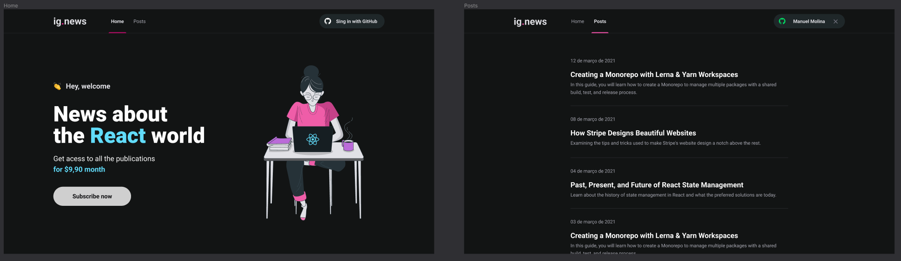

<h1 align="center">
   </> ig.news | Conteúdo de prático - Ignite ReactJS 
</h1>

<br/>

## 💻 Projeto
 Essa aplicação demonstra uma plataforma que oferece conteúdos sobre ReactJS, onde é possível conectar-se fazendo autenticação com github, virar um inscrito do blog e após a validação do pagamento é possível ter acesso a todos os conteúdos disponiveis.

## 🔖 Layout
 O layout pode ser acessado através do Figma, basta [clicar aqui](https://www.figma.com/file/u1DuTi6CU9pgeBy1Afc2tZ/ig.news?node-id=1%3A3)

 <h1 align="center">
    
</h1>

 <h1 align="center">
    
</h1>


 ## 🚀 Tecnologias

- [NextJS](https://nodejs.org/en/)
- [ReactJS](https://reactjs.org)
- [Typescript](https://www.typescriptlang.org/)
- [Scss](https://sass-lang.com/)
- [FaunaDB](https://fauna.com/)


### 📡 Ferramentas Complementares

- [Prismic](https://prismic.io/)
- [Eslint](https://eslint.org/)
- [Stripe](https://stripe.com/br)

<br/>


## 🤔 Como posso interagir com projeto?

- Para instalar localmente, siga os passos abaixo:

<br/>

```sh
git clone https://github.com/ManuelMolina02/ig-news.git
```

Após baixar o projeto, acesse o repositório via terminal e execute os seguintes comandos:

```sh
yarn install
yarn dev
```

<br/>
<br/>

Feito com 💜 por Manuel Molina 👋 Me contate através do [LinkedIn!](https://www.linkedin.com/in/manuel-angel-berger-molina-ba08b3174/)
